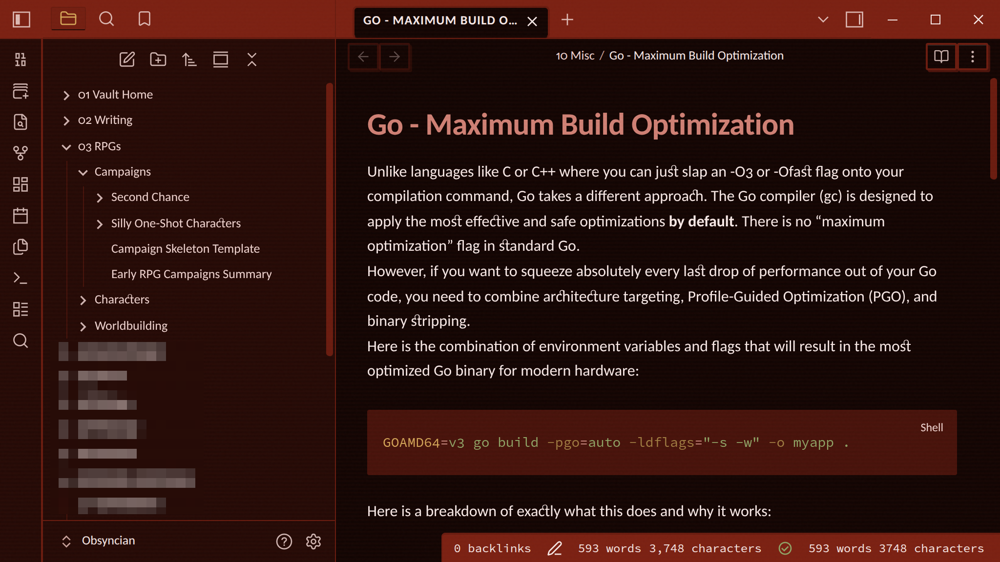

# Digital Rust for Obsidian



Digital Rust is a warm, tech-dystopian colour scheme for [Obsidian](https://obsidian.md/), inspired by corrupted hardware and failing systems. Built around deep rust-copper tones with strategic pops of colour named after system failures, the theme embraces the beauty of digital decay while maintaining excellent readability.

This is the official Obsidian port of [Digital Rust](https://digitalrust.katsuricata.com/), dark mode only.

## Installation

### From the community directory

Digital Rust can be installable directly from Obsidian via **Settings → Appearance → Themes → Manage**. [You can see it on the Obsidian theme directory here.](https://community.obsidian.md/themes/digital-rust)

### Manual

1. Download `theme.css` and `manifest.json` from the [latest release](https://github.com/KatSuricata/Obsidian-Digital-Rust/releases/latest).
2. Create a folder named `Digital Rust` inside your vault's `.obsidian/themes/` directory.
3. Place both files in that folder.
4. In Obsidian, open **Settings → Appearance** and select **Digital Rust** from the theme dropdown.

### For developers

Clone this repository into your vault's themes directory and select it in Obsidian:

```sh
cd /path/to/your/vault/.obsidian/themes/
git clone https://github.com/KatSuricata/Obsidian-Digital-Rust.git "Digital Rust"
```

CSS is linted against the official [stylelint-config-obsidianmd](https://github.com/obsidianmd/stylelint-config) rules used during community theme review:

```sh
npm install
npm run lint
```

The lint config relaxes exactly one rule: `selector-class-pattern` permits camelCase selectors, because Obsidian's own class names (`.cm-selectionBackground`, `.HyperMD-codeblock`, …) can't be renamed from a theme.

## Releasing

Versions are published as GitHub releases via GitHub Actions:

1. Bump the version in `package.json` and run `npm run version` to update `manifest.json` and `versions.json`.
2. Commit and push, then push a tag matching the new version number (for example `git tag 1.0.1 && git push --tags`).
3. The [release workflow](.github/workflows/release.yml) creates a draft release with `manifest.json` and `theme.css` attached; review and publish it.

## Related

- [Digital Rust design system](https://digitalrust.katsuricata.com/): specification and ports for other applications.

## License

[Apache License 2.0](LICENSE) © Kat Suricata
